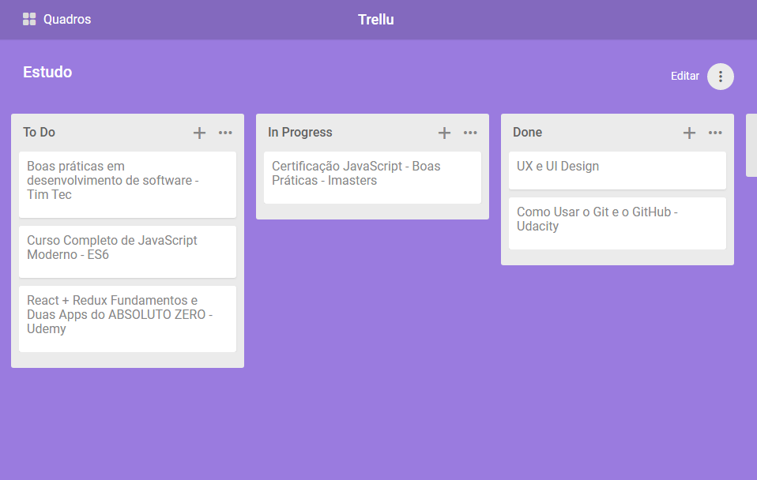

# Trellu



A project manager with boards, lists, and cards that let you organize and prioritize your projects, inspired by Github Projects and Trello.

You can see the project [here](https://trellu.netlify.com).

## Why?

This project is part of my personal portfolio, so, I'll be happy if you could provide me any feedback about the project, code, structure or anything that you can report that could make me a better developer!

[My contacts](#contact)

## Built With
- [Svelte JS](http://svelte.dev) - Cybernetically enhanced web apps
- [Dexie.js](https://dexie.org/) - A Minimalistic Wrapper for IndexedDB
- [SortableJS](https://github.com/SortableJS/Sortable) - A library for reorderable drag-and-drop lists.
- [Rollup.js](https://rollupjs.org) - Module bundler
- [Postcss](https://postcss.org/) - A tool for transforming CSS with JavaScript
- [ESLint](https://eslint.org/) - Linter

## Running locally

Clone the Repository

```sh
$ git clone https://github.com/valmisson/Trellu
```

Install dependencies and start the development server

```sh
$ cd Trellu

$ yarn

$ yarn dev
```

and navigate to [localhost:5000](http://localhost:5000/)

## Contact

Email-me: - missongrizorte@gmail.com

Connect with me at [Linkedin](https://www.linkedin.com/in/valmisson/)

My personal website - [valmisson.com](https://valmisson.com)

## License

This project is licensed under the MIT License - see [LICENSE](https://github.com/valmisson/Trellu/blob/master/LICENSE) for more information.
